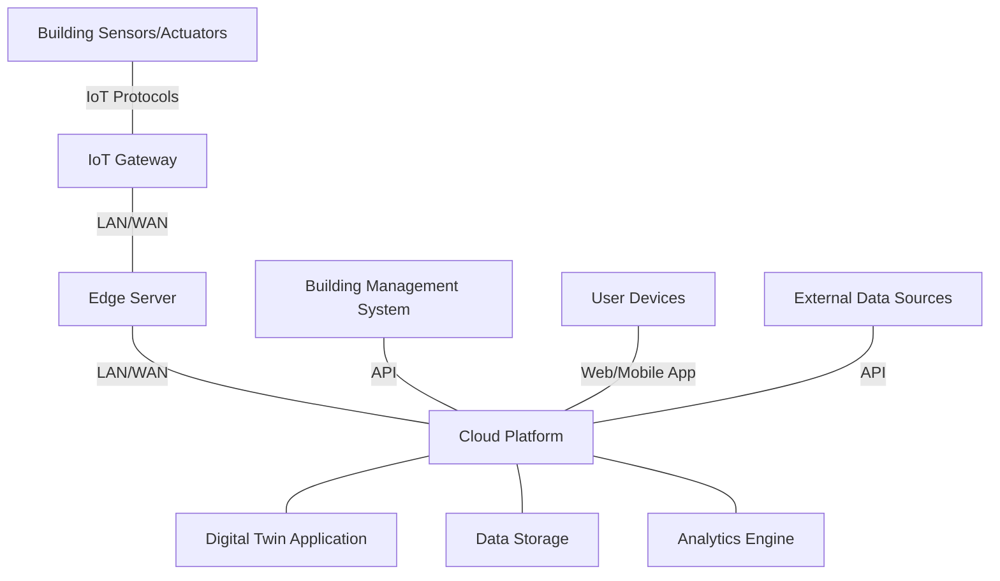
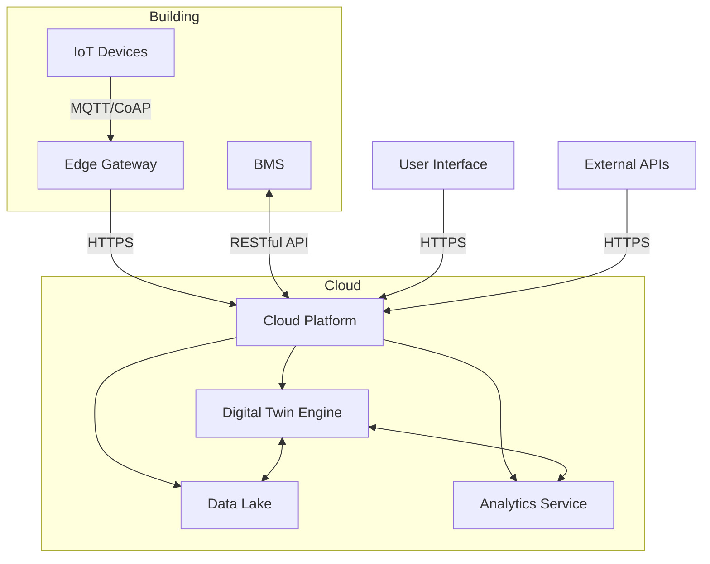
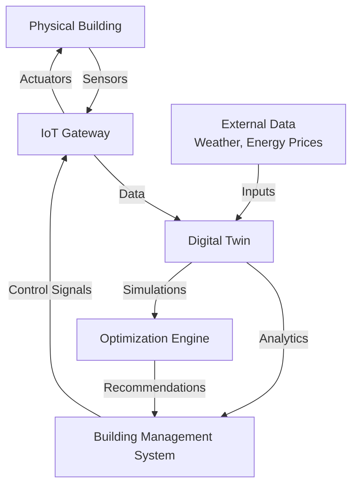

Let me explain each component of this network architecture:

1. Building Sensors/Actuators: These are the IoT devices distributed throughout the building, collecting data and controlling various systems.

2. IoT Gateway: Collects data from sensors and sends commands to actuators, often using protocols like MQTT, CoAP, or BACnet.

3. Edge Server: Provides local processing and storage, reducing latency for time-sensitive operations.

4. Cloud Platform: The central hub for data processing, storage, and hosting the digital twin application.

5. Digital Twin Application: The software that creates and maintains the virtual representation of the building.

6. Data Storage: Stores historical and real-time data from the building systems.

7. Analytics Engine: Processes data to provide insights, predictions, and optimizations.

8. Building Management System (BMS): Interfaces with the digital twin for monitoring and control of building systems.

9. User Devices: Allow operators and occupants to interact with the system via web or mobile applications.

10. External Data Sources: Provide additional context (e.g., weather data, energy prices) to enhance the digital twin's capabilities.

This architecture balances local processing (via the edge server) for real-time operations with cloud-based processing for more complex analytics and storage. It also ensures that the digital twin can integrate with existing building management systems and provide interfaces for various users.

The connections between components represent data flows, which can be over local area networks (LAN) within the building or wide area networks (WAN) for cloud connectivity. APIs (Application Programming Interfaces) are used to facilitate communication between different software systems.

This setup allows for scalability, as additional buildings or systems can be integrated by replicating the local components (sensors, gateways, edge servers) and connecting them to the central cloud platform.

Would you like me to elaborate on any specific part of this architecture or explain how it supports the digital twin capabilities we discussed earlier?

---

Certainly, I'll refactor the network architecture into a more concise and complete solution. This version will focus on the essential components while ensuring all necessary functionalities are covered.

This refactored architecture presents a more concise and complete solution. Let me explain the key components and their interactions:

1. IoT Devices: Encompasses all sensors and actuators in the building.

2. Edge Gateway: Collects data from IoT devices and provides local processing. It uses lightweight protocols like MQTT or CoAP for device communication.

3. Cloud Platform: The central hub for data processing and application hosting.

4. Digital Twin Engine: Core component that maintains the virtual representation of the building.

5. Data Lake: Stores all historical and real-time data.

6. Analytics Service: Provides advanced analytics, machine learning, and optimization capabilities.

7. Building Management System (BMS): Interfaces with the digital twin for building control.

8. User Interface: Web or mobile applications for user interaction.

9. External APIs: Integration points for weather data, energy prices, etc.

Key improvements in this refactored version:

- Simplified data flow: Clear pathways from IoT devices through the edge gateway to the cloud.
- Consolidated cloud services: Digital Twin Engine, Data Lake, and Analytics Service are now part of a unified cloud platform.
- Clearer separation of on-premises and cloud components.
- Explicit inclusion of communication protocols (MQTT/CoAP for IoT, HTTPS for secure internet communication, RESTful API for BMS integration).
- Bidirectional communication between the Digital Twin Engine and both the Data Lake and Analytics Service, showing the continuous feedback loop in the system.

This architecture supports all the previously mentioned capabilities:
- Real-time monitoring and control via the Edge Gateway and BMS integration.
- Predictive analytics and optimization through the Analytics Service.
- Data collection and storage in the Data Lake for historical analysis.
- Integration of external data through External APIs.
- User interaction through the User Interface.

The solution is scalable, secure, and efficiently balances edge and cloud computing needs for a comprehensive digital twin implementation in building control systems.

Would you like me to elaborate on any specific aspect of this refactored architecture?

---

Digital twins can be highly effective in IoT scenarios involving building control systems. Let's explore how they can be applied in this context:

This diagram illustrates how digital twins can be integrated into building control systems. Let me break it down:

1. Data Collection:
   - The physical building is equipped with various IoT sensors (temperature, humidity, occupancy, energy consumption, etc.).
   - These sensors continuously send data to an IoT gateway.

2. Digital Twin Creation:
   - The IoT gateway feeds this real-time data into the digital twin.
   - The digital twin is a virtual replica of the building, incorporating all its systems (HVAC, lighting, security, etc.).

3. Real-time Monitoring and Control:
   - The Building Management System (BMS) uses the digital twin for real-time monitoring of all building systems.
   - The BMS can send control signals back through the IoT gateway to adjust building systems (e.g., changing HVAC settings).

4. Predictive Analytics and Optimization:
   - The digital twin runs simulations and predictive models based on current data and historical patterns.
   - An optimization engine uses these simulations to recommend optimal settings for energy efficiency, comfort, and other parameters.

5. Integration of External Data:
   - The digital twin also incorporates external data like weather forecasts and energy prices to improve predictions and optimization.

Use cases for this setup include:

1. Energy Optimization: Predicting and optimizing energy usage based on occupancy patterns, weather forecasts, and energy prices.

2. Predictive Maintenance: Identifying potential issues in building systems before they cause problems, reducing downtime and maintenance costs.

3. Occupant Comfort: Balancing energy efficiency with occupant comfort by analyzing and predicting optimal environmental conditions.

4. Space Utilization: Analyzing occupancy patterns to optimize space usage and inform future building designs.

5. Emergency Response: Simulating emergency scenarios to improve safety protocols and response times.

6. Sustainability Tracking: Monitoring and reporting on various sustainability metrics in real-time.

This approach allows for more intelligent, responsive, and efficient building management, going beyond simple rule-based automation to create truly smart buildings.

Would you like me to elaborate on any specific aspect of this digital twin application in building control systems?
