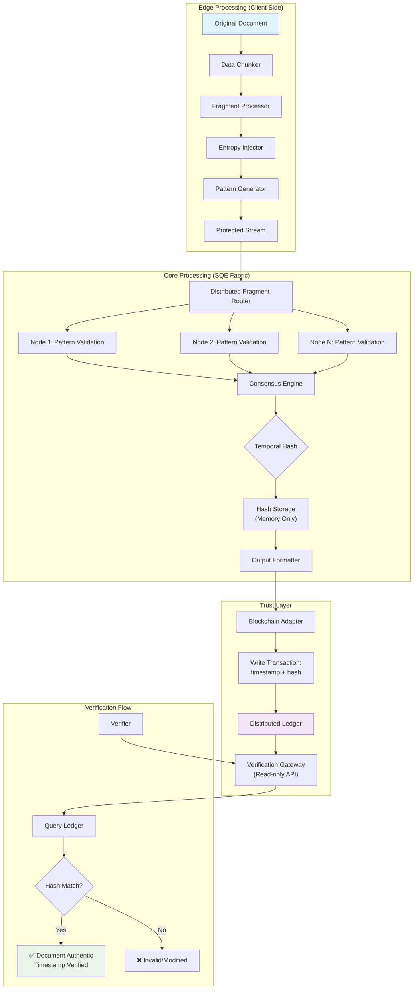

# **Technical Primitives: SQE Notary Architecture**



## **Core Primitives**

### **1. Data Transformation Engine**
```
Input: Document D (any format)
Process: D → Fragments → Entropy-Injected Patterns
Output: Protected stream P where P ≠ D
Property: P cannot be reversed without distributed consensus
```

### **2. Distributed Validation Fabric**
```
Architecture: N-node cluster, no persistent storage
Processing: In-memory pattern matching
Consensus: Threshold signature scheme
Output: Single hash H(D) + timestamp T
```

### **3. Immutable Recording**
```
Store: H(D) + T + metadata to blockchain
Not stored: D, P, or any reconstructable data
Verification: Compare hash of presented document with H(D)
```

### **4. Trust Interface**
```
Read API: Verify(hash) → {authentic: bool, timestamp: T}
Write API: Notarize(protected_stream) → {tx_id, hash}
```

## **Data Flow Summary**
```
Client: 
  Document → Fragment → Entropy → Protected Stream

SQE Core:
  Protected Stream → Distributed Validation → Consensus Hash

Blockchain:
  Hash + Timestamp → Immutable Record

Verification:
  Present Document → Compute Hash → Query → Match/Mismatch
```

## **Security Properties**
- No document storage
- No key management
- No single point of failure
- Quantum-resistant proofs
- Temporal integrity guarantees

That's the machine. Input document, output trust.
